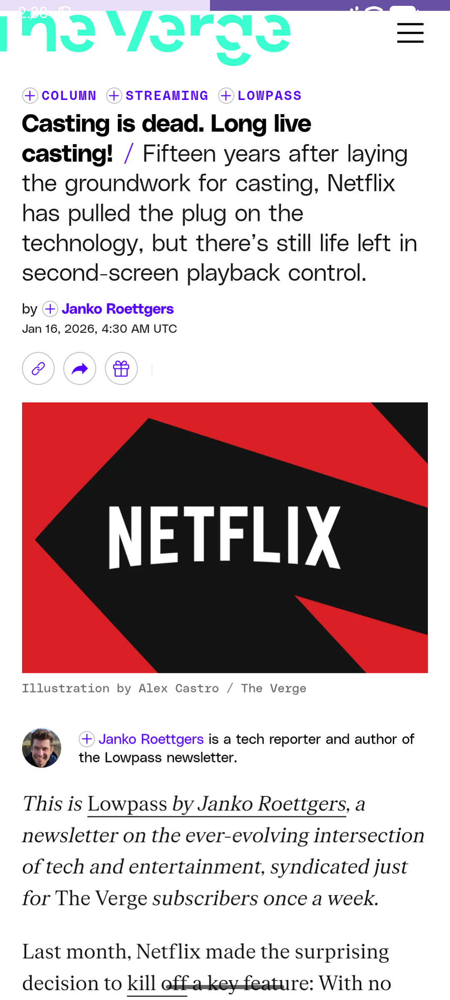

# 📰 NewsCloud - Flutter News Application

A modern Flutter news application that fetches and displays the latest news articles from various categories using the NewsAPI.

## 🎥 App Preview & Video Demo
This section provides a quick preview of the app's main features and demonstrates how it works across different screens and devices.

### 🧭 Feature Preview

#### 🏠 Home Screen


#### 🗂️ Category News Screen


#### 🌐 Article WebView Screen


---

## 📱💻 Video Demo

### 📱 Mobile (Android)
[Video demo link](https://github.com/ahmed-eltantawi/News_Cloud/assets/videoDemo/Android_demo.mp4)


https://github.com/user-attachments/assets/3e69b611-6ca3-45e1-84c7-ddd6983c1614


---

## 📋 Overview

NewsCloud is a clean and intuitive news reader app that allows users to browse news articles from different categories including Business, Entertainment, Science, Health, Sports, Technology, and General news. The app features a responsive interface with smooth scrolling and the ability to read full articles within the app.

## ✨ Features

- 📂 **Category-based News Browsing**: Navigate through different news categories with a horizontal scrollable list
- 🔄 **Real-time News Updates**: Fetches the latest news articles from NewsAPI
- 📖 **In-app Article Reader**: Read full articles using an integrated WebView without leaving the app
- ⏳ **Loading States**: Visual feedback while articles are being fetched
- 🛡️ **Error Handling**: Graceful error handling for network issues and failed requests
- 🎨 **Responsive Design**: Clean UI with smooth scrolling and optimized layouts

## 🎓 What I Learned

## 🎓 What I Learned

Through building this project, I gained experience with:

- 🌐 **API Integration**: How to fetch data from a REST API using the Dio package
- 📜 **Multiple Scrollable Lists**: Implementing both horizontal and vertical scrollable lists on the same page using Flutter's CustomScrollView and Slivers
- 🖥️ **WebView Integration**: Displaying external news websites inside the app using the webview_flutter package
- ⚡ **State Management**: Managing loading states and data flow using StatefulWidget
- 🚨 **Error Handling**: Implementing try-catch blocks and displaying user-friendly error messages
- 🔄 **Asynchronous Programming**: Working with Futures and async/await in Dart

## 🛠️ Technical Stack

- **Framework**: Flutter 3.10.1+ 🦋
- **HTTP Client**: Dio 5.9.0 📡
- **WebView**: webview_flutter 4.13.1 🌐
- **API**: NewsAPI (https://newsapi.org/) 📰

## 📁 Project Structure

```
lib/
├── Models/
│   ├── article_model.dart          # Data model for news articles
│   ├── CategoryModel.dart          # Data model for news categories
│   └── newsModels.dart             # Additional news models
├── Services/
│   └── get_news.dart               # API service for fetching news
├── Views/
│   ├── homesView.dart              # Main home screen
│   ├── CategoryNewsView.dart      # Category-specific news view
│   └── Article_web_view.dart      # WebView for full articles
├── Widgets/
│   ├── items/
│   │   ├── ArticaleWidget.dart    # Individual article card widget
│   │   └── CategoryWidget.dart    # Category card widget
│   ├── lists/
│   │   ├── News_List.dart         # News list builder
│   │   └── Category_List.dart     # Category list builder
│   ├── errors/
│   │   ├── errorsInAPI.dart       # API error handling
│   │   └── article_web_error.dart # WebView error handling
│   ├── newsListBulider.dart       # FutureBuilder for news list
│   └── loadingArticles.dart       # Loading state articles
└── main.dart                       # App entry point
```

## 🔑 Key Components

### 📡 News Fetching
The app uses the Dio package to make HTTP requests to NewsAPI's top-headlines endpoint, filtering by category to retrieve relevant articles.

### 📜 Sliver-based Scrolling
The app implements CustomScrollView with SliverList and SliverToBoxAdapter to create a seamless scrolling experience combining multiple scrollable elements:
- ➡️ Horizontal category list
- ⬇️ Vertical news articles list

### 🌐 WebView Integration
When users tap on an article, the app opens a WebView that loads the full article URL, allowing users to read the complete content without leaving the app.

## 🚀 Setup Instructions

1. 📥 Clone the repository
2. 🔑 Get your free API key from [NewsAPI](https://newsapi.org/)
3. ✏️ Replace the API key in `lib/Services/get_news.dart`
4. 📦 Run `flutter pub get` to install dependencies
5. ▶️ Run the app using `flutter run`

## 📂 API Categories

The app supports the following news categories:
- Business
- Entertainment
- Science
- Health
- Sports
- Technology
- General

## Error Handling

The app includes comprehensive error handling:
- Network request failures display an error message
- Missing images show a placeholder
- Failed WebView loads show an error screen
- Loading states with animated placeholders

## Future Enhancements

Potential improvements for the app:
- Add search functionality
- Implement article bookmarking
- Add pull-to-refresh
- Support for multiple news sources
- Dark mode support
- Offline reading capability

## License

This project is built for educational purposes.

## 🙏 Acknowledgments

- 📰 News data provided by [NewsAPI](https://newsapi.org/)
- 🦋 Built with Flutter framework
